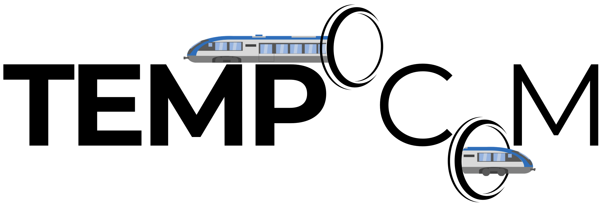
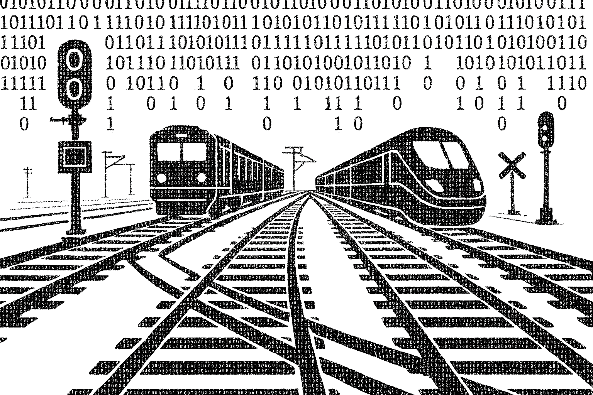
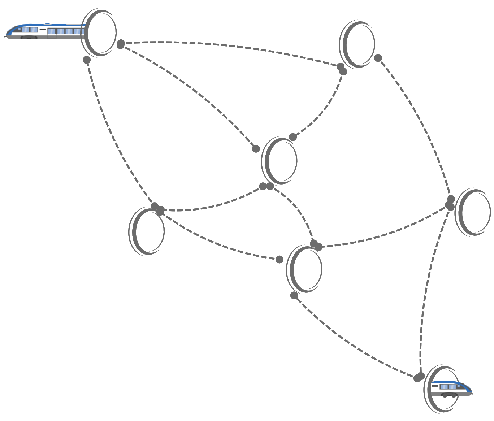
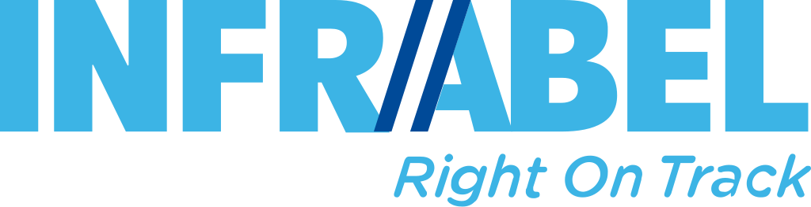
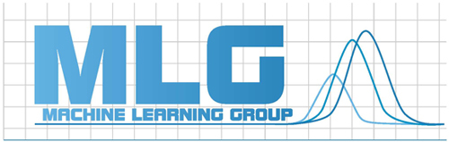

  

<h1 align="center">TEMPOCOM</h1>
<h3 align="center"><em>Time, Emission and Mode Optimization for Commuting</em></h3>

---

## 🚄 What is TEMPOCOM?

  

**TEMPOCOM** is a **Digital Twin** developed by **BRAIN** to optimize railway transport management.

The objective is to **identify and mitigate network capacity losses** to enhance the **robustness** and **flexibility** of the railway network.  
In collaboration with key railway stakeholders, the project analyzes the **root causes of disruptions** and proposes **optimization strategies** to improve resilience.

  

---

## 🎯 Objective

  

> Digitize the management of railway infrastructure using **state-of-the-art algorithmic tools** to consistently provide the best solutions to network operators.

TEMPOCOM focuses on cutting-edge optimization in terms of:
- 🕒 **Performance (delay reduction, capacity increase)**
- 💰 **Cost-efficiency**
- 🌍 **Environmental sustainability**

---

## 🔍 Key Features

### 📉 Causal Analysis of Network Disruptions
Leveraging advanced **machine learning** and **predictive modeling**, the system uncovers **root causes** behind issues such as:
- Technical failures  
- Network congestion  
- Adverse weather conditions

---

### 🔁 Data-Driven “What-If” Simulations
Explore **scenario-based simulations** to assess the impact of operational decisions, allowing operators to:
- Experiment with alternative strategies  
- Anticipate and mitigate future disruptions

---

### 🚦 Optimization Engine for Strategic Decision-Making
Simulation results feed into a powerful **optimization engine** that provides:
- Actionable recommendations  
- Improved flow for passenger and freight operations  
- Long-term strategic planning tools

---

## 🧪 Try it out

Play with different labs featuring railway use cases.

  

---

## 🤝 Our Partners

  
  

